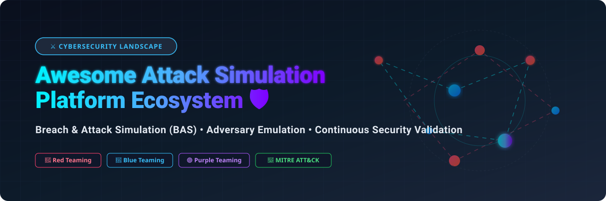
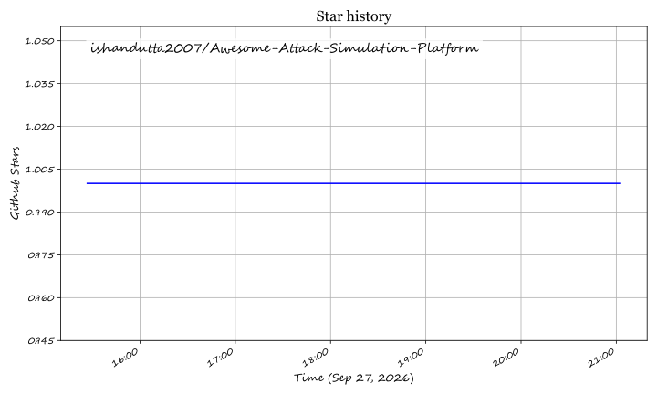

# 🛡️ Awesome Attack Simulation Platform

     

**Curated List of SaaS Products & Open-Source GitHub Projects for Attack Simulation**  
*Focused on Breach & Attack Simulation (BAS), Adversary Emulation, Continuous Security Validation & MITRE ATT&CK Mapping*

---

## 📌 Overview & SEO Intro

Welcome to the **Awesome Attack Simulation Platform** directory — the definitive, community-driven resource for cybersecurity professionals, purple teams, detection engineers, and red teamers. 

This repository tracks top-tier **SaaS enterprise platforms** and **open-source security tools** designed for **Breach and Attack Simulation (BAS)**, **Adversary Emulation**, **Autonomous Penetration Testing**, and **Continuous Security Posture Validation**. These platforms enable security operations centers (SOCs) to simulate real-world cyberattacks, test EDR/SIEM telemetry, validate defensive controls against MITRE ATT&CK techniques, and measure vulnerability remediation efficacy in production environments.

---

## 📑 Table of Contents

- [🏢 SaaS & Hosted Enterprise Platforms](#-saas--hosted-enterprise-platforms)
- [🔓 Open-Source GitHub Projects](#-open-source-github-projects)
- [⚙️ Attack Simulation Frameworks & Architectures](#%EF%B8%8F-attack-simulation-frameworks--architectures)
- [🤝 How to Contribute](#-how-to-contribute)
- [📈 Star History](#-star-history)
- [💖 Support & Sponsorship](#-support--sponsorship)
- [⚠️ Disclaimer](#%EF%B8%8F-disclaimer)

---

## 🏢 SaaS & Hosted Enterprise Platforms

**Market Size & Sector Overview:** The global Breach and Attack Simulation (BAS) & Continuous Security Validation market is estimated at **$550M–$1.0B in 2025/2026** (projected to reach **$3.6B–$16B by 2033** at a CAGR of ~22–40%). The sector is **moderately fragmented**, featuring specialized category leaders alongside emerging AI-native platforms evolving towards broader exposure management consolidation.

| Platform | Description | Company Size (Valuation / Revenue) | Starting Price | Free Tier / Trial Limit |
| :--- | :--- | :--- | :--- | :--- |
| 🚀 **[Horizon3.ai](https://horizon3.ai/)** | Autonomous penetration testing platform (NodeZero) discovering exploitable vulnerabilities and validating attack paths with proof-of-exploit. | >$2.0B Valuation ($250M Series E, 120% YoY ARR growth) | ~$99/target for ad-hoc NodeZero pentest runs | 30-day Free Trial (up to 1 free internal/external node run upon credential verification) |
| 🛡️ **[Pentera](https://www.pentera.io/)** | Automated penetration testing platform simulating full attack chains from external and internal perspectives with actionable remediation. | >$1.0B Valuation ($117M ARR, Series D) | ~$35,000/year base annual subscription | No free trial (1-on-1 personalized live environment demo available) |
| 🌐 **[XM Cyber](https://www.xmcyber.com/)** | Hybrid cloud exposure management platform simulating attack paths to critical assets, identifying and prioritizing remediation. | $700M Acquisition Value ($10M–$20M ARR) | ~$24/unit/year (£18/unit/year) enterprise tier | Custom-scoped 14-day Free Trial available via sales demo consultation |
| 🔄 **[Cymulate](https://cymulate.com/)** | Extended security posture management platform with BAS, automated red teaming, and attack surface validation across email, web, and endpoint vectors. | $141M Total Funding (~$30M+ ARR) | ~$7,000/year starting modular tier | 14-day Free Trial with access to core validation modules |
| 🐥 **[Red Canary](https://redcanary.com/atomic-red-team/)** | Managed continuous security validation platform with commercial orchestration built around Atomic Red Team. | $130M Total Funding ($100M+ ARR) | ~$120/endpoint/year starting managed subscription tier | No free trial for hosted SaaS platform (free open-source YAML library available) |
| ⚔️ **[SafeBreach](https://www.safebreach.com/)** | Continuous security validation platform with 20,000+ attack methods simulating known threat actor behaviors across the kill chain. | $106M Total Funding (~$21M ARR) | ~$25,000/year starting subscription tier (4 customizable tiers) | No free trial (guided proof-of-concept / sandbox demo on request) |
| 🎯 **[Picus Security](https://www.picussecurity.com/)** | Security validation platform combining BAS with threat intelligence, measuring detection and prevention effectiveness across security stack. | $77M Total Funding (~$15M–$20M ARR) | ~$10,000/year starting subscription | 14-day Free Trial for Security Validation Platform |
| 📊 **[AttackIQ](https://www.attackiq.com/)** | Breach and attack simulation platform built on MITRE ATT&CK, enabling continuous validation of security controls with automated attack scenarios. | $73M Total Funding (~$15M ARR) | ~$15,000/year starting *Flex* testing package tier | AttackIQ Flex free tier (free access to basic ATT&CK testing packages & research) |
| 🗡️ **[Scythe](https://scythe.io/)** | Adversary emulation platform with threat intelligence-driven attack scenarios, purple team collaboration, and detection validation. | ~$15M Funding (~$5M–$10M ARR) | ~$15,000/year practitioner starting license | No free trial (guided interactive sandbox demo on request) |
| 🎮 **[ThreatGen](https://www.threatgen.com/)** | Cyber range and attack simulation platform with gamified red team/blue team exercises for training and validation. | Early-Stage / Bootstrapped (~$1M–$3M ARR) | $75/year for Individual Pro; $1,500/year for Business tier | No free trial (free interactive video demo and sample scenarios on request) |

---

## 🔓 Open-Source GitHub Projects

Below is a curated collection of active open-source projects for self-hosted Breach and Attack Simulation, adversary emulation, command-and-control (C2), and detection engineering labs. **Sorted by GitHub Stars_Count (descending):**

1. ⚛️ **[Atomic Red Team](https://github.com/redcanaryco/atomic-red-team)**   
   The industry-standard library of simple, testable YAML files mapped directly to MITRE ATT&CK techniques. Designed for rapid execution and blue team detection validation across Windows, Linux, and macOS environments.

2. 🗡️ **[Sliver C2 Framework](https://github.com/BishopFox/sliver)**   
   Cross-platform, open-source adversary emulation and Command & Control (C2) framework developed by Bishop Fox. Features mTLS/WireGuard/HTTP/DNS C2 channels, dynamic code injection, and multi-operator red team campaign orchestration.

3. 🌋 **[MITRE Caldera](https://github.com/mitre/caldera)**   
   The leading automated adversary emulation system created by MITRE. Built on lightweight cross-platform agents (Sandcat) paired with a central C2 orchestrator that executes ATT&CK-mapped abilities and adversary playbooks for red/purple teaming.

4. 🧪 **[Splunk Attack Range](https://github.com/splunk/attack_range)**   
   Automation framework using Terraform and Ansible to deploy instrumented cloud environments (Splunk, Active Directory, Kali, Zeek). Integrates with Atomic Red Team to generate realistic attack telemetry for detection development.

5. ⚡ **[OpenBAS](https://github.com/OpenBAS-Platform/openbas)**   
   ISO 22398-compliant Breach and Attack Simulation platform created by Filigran. Simulates technical attacks and organizational crisis scenarios (executive inquiries, media leaks) with AI scenario generation and OpenCTI threat intelligence integration.

6. 🐒 **[Infection Monkey](https://github.com/guardicore/monkey)**   
   Open-source, agent-based adversary emulation tool by Akamai/Guardicore. Features a central web control server ("Monkey Island") and self-propagating agents ("Monkeys") to test lateral movement and Zero Trust network boundaries.

7. 🤖 **[Red Team Automation (RTA)](https://github.com/endgameinc/rta)**   
   Framework of python scripts designed by Endgame to execute malicious behaviors mapped to MITRE ATT&CK tactics, helping detection engineers verify EDR alerting rules.

8. ☁️ **[Stratus Red Team](https://github.com/DataDog/stratus-red-team)**   
   Known as "Atomic Red Team for the Cloud", this tool by Datadog provides granular, actionable attack techniques specifically targeting AWS, Azure, GCP, and Kubernetes environments.

9. 🟣 **[PurpleSharp](https://github.com/mvelazc0/PurpleSharp)**   
   C#-based adversary simulation tool for Windows Active Directory environments. Automates complex attack paths remotely over SMB/RPC to measure Active Directory defense metrics.

10. 📈 **[VECTR](https://github.com/srasecurity/vectr)**   
    Open-source purple team tracking, reporting, and posture assessment tool developed by Security Risk Advisors for measuring detection coverage across purple team exercises.

11. 🌊 **[Attack Flow](https://github.com/center-for-threat-informed-defense/attack-flow)**   
    Language and visualization schema created by the MITRE Engenuity Center for Threat-Informed Defense to describe and map complex, multi-stage attack chains and threat actor behaviors.

12. 💥 **[DumpsterFire](https://github.com/joewalnes/dumpsterfire)**   
    Modular event-driven adversary simulation rule-engine for building custom attack scenarios and delay-based cyber incident simulations (preserved for historical context).

---

## ⚙️ Attack Simulation Frameworks & Architectures

Building a enterprise-grade, vendor-independent continuous attack simulation program requires combining complementary open-source components:

- **Core Adversary Emulation Engine:** Deploy **[MITRE Caldera](https://github.com/mitre/caldera)** for central orchestration, automated agent execution, and ATT&CK playbook scheduling.
- **Granular Test Case Library:** Integrate **[Atomic Red Team](https://github.com/redcanaryco/atomic-red-team)** as raw atomic test primitives to validate specific SIEM/EDR rule triggers.
- **Cloud & Container Validation:** Use **[Stratus Red Team](https://github.com/DataDog/stratus-red-team)** for AWS, Azure, GCP, and Kubernetes attack techniques.
- **Incident Response & Crisis Simulation:** Utilize **[OpenBAS](https://github.com/OpenBAS-Platform/openbas)** paired with OpenCTI to model non-technical communication flows alongside technical attack vectors.
- **Telemetry & Detection Lab Infrastructure:** Spin up **[Splunk Attack Range](https://github.com/splunk/attack_range)** to analyze log ingestion and detection fidelity under real attack scenarios.

---

## 🤝 How to Contribute

Contributions are warmly welcomed! Help keep this cybersecurity repository complete and up to date:

1. **Fork** the repository.
2. Add or edit entries in `README.md` maintaining the existing tabular/list format.
3. Ensure added projects include: Name, Link, GitHub Stars_Badge (for open source), 1–2 sentence factual description, and category.
4. Submit a **Pull Request** with a clear explanation of your additions.

Please review our curated resources at [Awesome-Awesome-Awesome](https://github.com/ishandutta2007/Awesome-Awesome-Awesome).

---

## 📈 Star History

---

## 💖 Support & Sponsorship

Thank you for exploring the **Awesome Attack Simulation Platform** ecosystem! 🚀 If this project helps your security team, purple teaming exercises, or research, please consider showing support:

- ⭐ **Star** this repository to increase visibility for security researchers.
- 🔀 **Fork** it to keep your own reference copy and submit contributions.
- 📢 **Share** this list with colleagues, red/blue teams, and security communities.
- ☕ **Sponsor / Buy me a coffee**: Support ongoing open-source curation via the [GitHub Sponsor Dashboard](https://github.com/sponsors/ishandutta2007).

---

## ⚠️ Disclaimer

- This list is **community-curated** for educational, defensive security research, and security validation purposes.
- All attack simulation tools must be operated **exclusively** within authorized environments with proper legal authorization and explicit written scope.
- Self-hosted open-source software requires infrastructure security hardening and ongoing maintenance.

## Star History

<a href="https://star-history.com/#ishandutta2007/Awesome-Attack-Simulation-Platform&Timeline" align="center">
  <picture>
    <source media="(prefers-color-scheme: dark)" srcset="assets/ishandutta2007_Awesome-Attack-Simulation-Platform_growth.svg">
    
  </picture>
</a>
